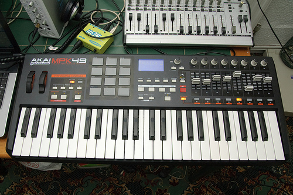
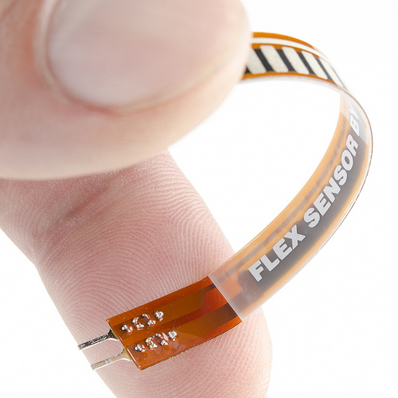
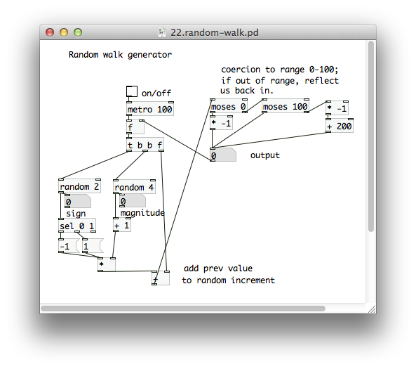

# MCUs for Computer Music

An MCU is a Microcontroller Unit, which is essentially just a really small computer used for embedded applications. [Arduino](http://www.arduino.cc) is a very popular open source MCU platform designed for creatives and hobbyists to make building interactive devices easy. It's primary job is usually to read from sensors and communicate simple messages.

In computer music, we can use an MCU to create interactive objects
such as controllers and instruments that explore musical expression and simple sound generation.  

## MIDI

### Traditional Configurations

In a typical MIDI setup, there is a controller, such as a keyboard, drum pads, or surface, that send messages to a sound module such as a synthesizer, instrument emulator, or computer.  

In this example, an MCU could serve as the computer that detects when a key is pressed, a pad is hit, or knob is turned and send the appropriate message to the sound module.

### New Interfaces

Traditional controls are only the beginning.  There are many sensors out there that can react to things like light, flex, temperature, force, or liquid levels.  This leaves options wide open for creating new and unique devices for musical expressions.

### Generative Music

An MCU can also generate MIDI messages without a sensor.  By programming the device to loop through steps and functions you can make unique rhythms and melodies with generative or algorithmic music.

## How to Get Started

If you have your own synthesizers, sound modules, or computer MIDI interface start with the: [Create Your Own MIDI Prototype Cables](../MIDI_Cable).

Or, if you will be using a computer, check back soon for the guide: 3 Easy Ways to Add MIDI to an Arduino. 