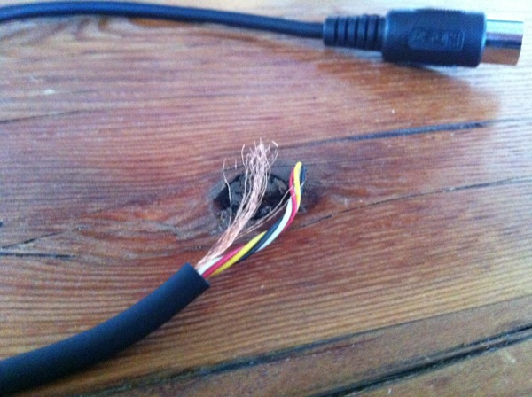

How to Make a MIDI Cable with Headers

## Materials Required

Cabling

* MIDI Cable
* Wire Cutters
* Wire Strippers

For the Pins

* [Crimping Tool](http://www.pololu.com/catalog/product/1928)
* [Male](http://www.pololu.com/catalog/product/1931) or [Female](http://www.pololu.com/catalog/product/1930) Crimp Pins
* [Connector Housings](http://www.pololu.com/catalog/product/1900)

## Instructions

Step 1 - Gather Supplies

Step 2 - Cut Cable in Half

Step 3 - Remove ~ 1" of the sheath

Step 4 - Strip Approx 3mm off the wires
Step 5 - Twist together the shield

Step 6 - Crimp on pins and insert into housings

Here's an awesome video [awesome video guide](https://www.youtube.com/watch?v=GkbOJSvhCgU) on crimping.

## Use

Use a multimeter to test which pin connects to which wire.
Use with arduino or other circuits for computer controller MIDI.

Be sure to follow a circuit to optoisolate incoming MIDI signals or a 220 ohm resister for out going.
